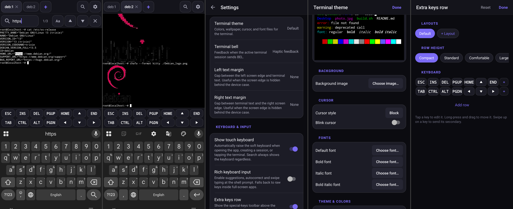

# Terminal

Probably the first ever [Ghostty-based](https://github.com/ghostty-org/ghostty)
terminal emulator app for Android OS. Developed with heavy use of AI agentic
coding (Claude Code, ChatGPT Codex), independently from
[Termux](https://termux.dev) and similar apps.

Features:

- All or almost all features of Ghostty VT engine, including Kitty graphics
  protocol, etc
- Fast terminal rendering
- 2 session modes: Linux userland (Debian proot, default) and standard
  Android `/system/bin/sh`
- Pinch-zoom to change font size
- Terminal text search
- Userland backup/restore via tar archives
- Configurable terminal themes with preview + builder for custom themes
- Configurable extra keys
- Optional mouse reporting
- Optional word-based input for rich keyboard features (word suggestions, etc)



*Currently lacks storage permissions and some other important features as app
is very fresh.*

Some features will NOT be implemented:

- Google Play, F-Droid or other stores distribution
- Right-to-left input (VT engine issue)
- Ambiguous-width characters as double width (VT engine issue)
- Native, [Termux](httos://github.com/termux/termux-app)-like
  Android-compatible userland
- Android API bridge like [Termux:API](https://github.com/termux/termux-api)
- On-boot automation like [Termux:Boot](https://github.com/termux/termux-boot)
- Tasker and other automation apps integration
- Camera, microphone and other hardware access
- Chroot instead of proot for rooted devices
- AI and other external services integration

## Requirements

End user:

- Android OS version 10 and newer (the Zig-built Ghostty library needs Bionic
  ELF TLS)
- 64-bit CPU architecture (AArch64 or x86_64)

Developer:

- Android SDK (platform 36, build-tools) and NDK r27+
- JDK 17–21 to run Gradle
- Host `cmake` ≥ 3.22 and `ninja` (or install the SDK cmake package)
- Device/emulator with API 29+

Zig is **not** required to build the app; it is only needed to regenerate
the prebuilt Ghostty library (see [docs/native-build.md](docs/native-build.md)).

## Build

Create `local.properties`:

```properties
sdk.dir=/path/to/Android/Sdk
# Only if the SDK has no cmake package; directory must contain bin/cmake:
cmake.dir=/usr
```

If the NDK is not installed inside the SDK, set `ndkPath` via
`ANDROID_NDK_HOME` or add `android.ndkPath` in `local.properties`.

```sh
./gradlew :app:assembleDebug
adb install app/build/outputs/apk/debug/app-debug.apk
```

### Bundling the Debian userland

Place rootfs tarballs in `DebianRootfs/` at the repo root before building
(the directory is gitignored — the tarballs are never committed):

```
DebianRootfs/debian_trixie_aarch64_rootfs.tar.xz
DebianRootfs/debian_trixie_x86_64_rootfs.tar.xz
```

When present they ship as APK assets and the app extracts the one matching
the device ABI on first launch (a few seconds, with on-screen progress).
Without them the app builds and runs as a plain Android-shell terminal.
The tarballs must contain a Debian root directory tree made of regular
files, directories and links only (e.g. produced by debootstrap).

## Usage

- **Typing**: tap the terminal to open the keyboard. Text goes straight to
  the shell; arrows/ESC/etc. are encoded per active terminal modes.
- **Toolbar**: `CTRL` and `ALT` are sticky — tap `CTRL`, then `c` to send
  Ctrl-C. Other keys (ESC, TAB, arrows, HOME/END, PGUP/PGDN) send
  immediately.
- **Tabs**: `+` opens a new session (Debian when installed, Android shell
  otherwise); **long-press `+`** opens the other kind. Tap a tab to
  switch; `×` closes the current one. Closing the last tab exits the app.
- **Debian**: you are (fake) root; `apt update && apt install …` works.
  Networking uses the app's permissions; everything actually runs as the
  app's unprivileged uid.
- **Scrollback**: drag vertically on the terminal. Any key press snaps back
  to the bottom.
- **Font size**: pinch to zoom (8–40 sp, persisted across restarts); the
  shell grid reflows to the new cell size.
- **Lifecycle**: sessions survive rotation but not process death; there is
  no background service keeping shells alive once the app is killed.

## Tests

Integration tests run on a connected device/emulator:

```sh
scripts/setup-emulator.sh   # one-time AVD creation (needs KVM)
scripts/run-emulator.sh
./gradlew connectedDebugAndroidTest
```

See [docs/testing.md](docs/testing.md).

## Documentation

- [docs/architecture.md](docs/architecture.md) — components, data flow, key
  decisions
- [docs/native-build.md](docs/native-build.md) — how the Ghostty library is
  cross-compiled and how to upgrade it
- [docs/testing.md](docs/testing.md) — test suites and how to run them
